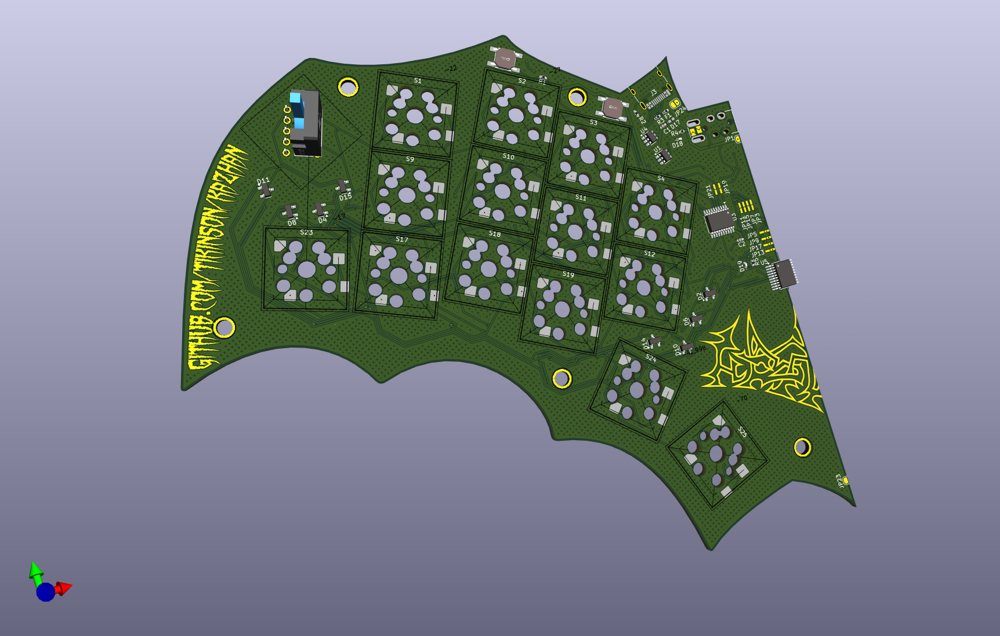

# 🦇Kazhan🦇

28 Keys. MX and Choc compatible keyboard with CH552T controller. This is the next logical step after my experimental keyboard [ToadsTempest](https://github.com/tikinson/ToadsTempest).

## Idea

Kazhan (Кажан) is derived from the Ukrainian word meaning "bat".
As a fan of ZilpZalp/Hummingbird projects i decided make something with same layout but more personalized. Same but different.

## What this project is and what it is not

### Goals:
- A pet project of a keyboard as an act of absolute self-expression.
- Flexibility and experiments over (and maybe in some case against) minimalistic design approach.
- Testing interesting "non - conventional" switches as extra keys.
- Testing things that i don't saw (yet?) in another keyboard PCB designs.

### Non-goals:
- Creation of another variant of the Corne (I like Corne btw, that was my first love in this hobby).
- Design with a definite assembly variant.
- Go through the steps in the keyboard design that I have already tried.

## Features

- Mirrored design of PCB to provide split and unibody functionality in one design.
- Alpsalpine limit switches (SW1, SW2 on schematics) as additional switches. I accidentaly understood, that MX keycap kinda fits on them (with 45 dergee rotation), so i would give them a try.
- Wired USB-C (USB 2.0) connection.
- Designed for usage with [really affordable chip](https://www.lcsc.com/product-detail/USB-ICs_WCH-Jiangsu-Qin-Heng-CH552T_C111367.html) and [F.A.K.](https://github.com/semickolon/fak?tab=readme-ov-file) firmware.
- Japanese (duplex) matrix of keys and diodes for them: first of all, it's way more easy to solder one dual diode instead of two regular, because you will never put this part with wrond polarity. And also because of type of key matrix, there is two types of dual diodes: with common anode and common cathode.

## Layout

## BOM

Opening local copy of [ibom.html](./bom/ibom.html) could save some times while soldering.

| Reference       | Value                | Footprint                                                   | Qty | LCSC      |
|-----------------|----------------------|------------------------------------------------------------|-----|-----------|
| C1, C2          | 100nF               | Capacitor_SMD:C_0402_1005Metric_Pad0.74x0.62mm_HandSolder  | 2   | C1525     |
| D1, D4, D5, D8, D9, D11, D13, D15 | BAS70-06-CAnode   | Package_TO_SOT_SMD:SOT-23                                 | 8   | C8651     |
| D2, D3, D6, D7, D10, D12, D14, D16 | BAS70-05-CCatode  | Package_TO_SOT_SMD:SOT-23                                 | 8   | C34489    |
| D17             | PMEG2010EA          | Diode_SMD:D_0402_1005Metric_Pad0.77x0.64mm_HandSolder      | 1   | C2837790  |
| D18, D19        | PWR LED             | LED_SMD:LED_0402_1005Metric                                | 2   | C130724   |
| F1              | 500mA               | Fuse:Fuse_0402_1005Metric_Pad0.77x0.64mm_HandSolder        | 1   | C210357   |
| J3              | USB_C_Receptacle_USB2.0 | Connector_USB:USB_C_Receptacle_HRO_TYPE-C-31-M-12         | 1   | C2765186  |
| R1, R6          | 10k                 | Resistor_SMD:R_0402_1005Metric_Pad0.72x0.64mm_HandSolder   | 2   | C25744    |
| R2, R3          | 5.1k                | Resistor_SMD:R_0402_1005Metric_Pad0.72x0.64mm_HandSolder   | 2   | C25905    |
| R4, R5          | 1k                  | Resistor_SMD:R_0402_1005Metric                             | 2   | C11702    |
| SW1, SW2        | ~                   | MyFootprintsCollection:SW-TH_SSCF110100                   | 2   | C470322   |
| SW4, SW6        | RESET               | KEY-SMD_4P-L4.8-W4.8-P3.70-LS6.4-TL                        | 2   | C2888968  |
| S1–S28          | Keyswitch           | SW_Hotswap_Kailh_Choc_MX_1.00u_One_Sided                   | 28  |           |
| U1, U4          | USBLC6-2SC6         | Package_TO_SOT_SMD:SOT-23-6                                | 2   | C2687116  |
| U2, U3, U5      | CH552T              | -- mixed footprints --                                     | 3   | C111367   |

#### Note: S1-S28 - is footprints for switches. You can choose between MX or Kailh Choc switches (or both if you like experiments) and solder hotswaps accordingly.  