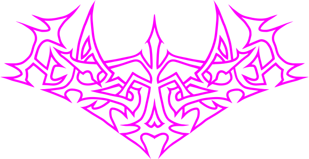

# 🦇Kazhan🦇

28 Keys. MX and Choc compatible keyboard with CH552T controller. This is the next logical step after my experimental keyboard [ToadsTempest](https://github.com/tikinson/ToadsTempest).

## Idea

Kazhan (Кажан) is derived from the Ukrainian word meaning "bat".
As a fan of ZilpZalp/Hummingbird projects i decided make something with same layout but more personalized. Same but different.

## What this project is and what it is not

### Goals:
- A pet project of a keyboard as an act of absolute self-expression
- Flexibility and experiments over (and maybe against) minimalistic design approach
- Testing interesting "non - conventional" switches as extra keys
- Testing things that i don't saw (yet?) in another designs

### Non-goals:
- Creation of another variant of the Corne (I like Corne btw, that was my first love in this hobby).
- Design with a definite assembly variant
- Go through the steps in the keyboard design that I have already tried

## Features

## Layout

## BOM